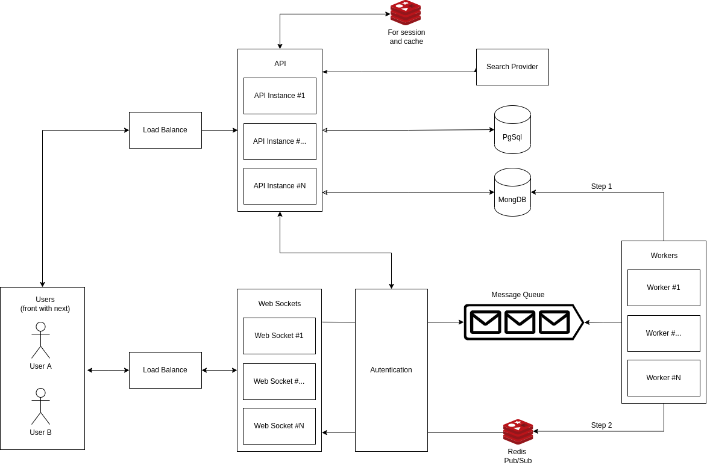

# Real-Time Chat Application

Este projeto é uma aplicação de chat em tempo real, desenvolvida como parte do desafio para a vaga de Desenvolvedor Full Stack na Labzz. A aplicação foi construída utilizando tecnologias modernas, proporcionando uma comunicação eficiente e escalável entre usuários.

## Arquitetura da Aplicação

A arquitetura da aplicação foi desenhada para suportar escalabilidade, alta disponibilidade e desempenho, utilizando uma combinação de APIs, WebSockets, balanceamento de carga e filas de mensagens.

### Componentes Principais:

1. **Usuários (Front-end com Next.js)**: A interface do usuário foi construída utilizando Next.js com TypeScript, oferecendo uma experiência de chat responsiva e dinâmica.
> Pensando em otimizar tempo, o Login e a base do repositório foi feita com o [Laravel Breeze For Next](https://github.com/laravel/breeze-next). E a interface do chat sim feita do zero.

2. **Balanceamento de Carga**: Garante a distribuição eficiente do tráfego entre múltiplas instâncias de APIs e WebSockets.

3. **API**: Implementada utilizando Laravel, a API é responsável por gerenciar as comunicações entre o front-end e os serviços de back-end e como um broker para autenticação.

4. **WebSockets**: Responsáveis por permitir a comunicação em tempo real entre os usuários. As conexões WebSocket são gerenciadas e escaladas dinamicamente.

5. **Autenticação e autorização**: Implementada com Laravel Sanctum.
> A ideia era utilizar o Auth2 com o Laravel (Socialite) (https://laravel.com/docs/11.x/socialite). Mas para otimizar o tempo, foi utilizado o [Sactum com o Breeze](https://laravel.com/docs/11.x/starter-kits#breeze-and-next).

6. **Banco de Dados (MongoDB e PostgreSQL)**: Utilizados para armazenamento de dados estruturados e não estruturados. O MongoDB armazena mensagens, enquanto o PostgreSQL é utilizado para armazenar informações de usuários.

7. **Cache (Redis)**: Utilizado para armazenar sessões de usuários e dados de cache, melhorando o desempenho da aplicação.

8. **Filas de Mensagens (Message Queue)**: Utilizadas para processamento assíncrono de mensagens, garantindo que as mensagens sejam entregues mesmo em caso de falhas temporárias.
> Por uma questão de tempo, foi implementado utilizando o Redis com o (BullMQ)[https://docs.bullmq.io]. Mas para este caso onde pode haver um high-throughput, talvez seja mais interessante utilizar o Kafka. 

9. **Workers**: Processos assíncronos que consomem mensagens da fila para processamento e entrega eficiente.

## Deployment na Nuvem

Em desenvolvimento...
> A ideia seria utilizar serviços de cloud como AWS Beanstalk, Redis Enterprise ou Elastic Cache (Redis Enterprise pode ser mais barato a depender do uso), MongoDB Atlas, e RDS.

## Instalação e Execução

Em desenvolvimento...
> Docker em processo de configuração. Mas por hora é possível executar a API em Laravel com o Sail e o ws w o frontend com npm i && npm run dev

## Tecnologias Utilizadas

- **Laravel**: API.
- **Node.js** com **TypeScript**: Websocket, Queue Feeder e Queue Worker.
- **Next.js** com **TypeScript**: Frontend.
- **MongoDB** e **PostgreSQL**: Bancos de dados.
- **Redis**: Cache e sessões.
- **WebSockets**: Comunicação em tempo real.
- **Docker**: Containerização da aplicação.
